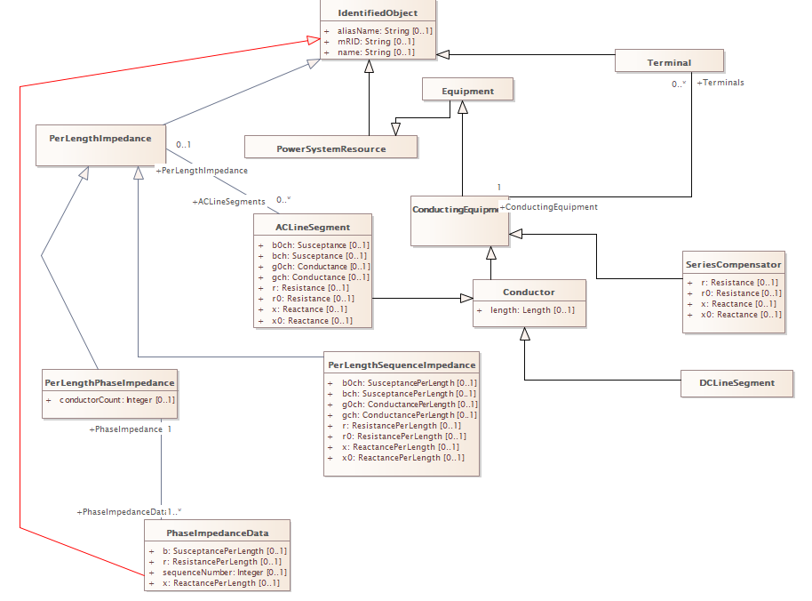

This project involves modeling a power system structure based on the CIM (Common Information Model) standard, specifically focusing on the ACLineSegment and its related classes. The application includes a WPF-based GUI, CIM/XML manipulation, GDA (Generic Data Access) integration, and the use of generated code based on an RDFS-exported CIM profile.

Technologies Used:
WPF (Windows Presentation Foundation)
C#
CIM/XML & CIM Profiles
RDFS, XMI
GDA (Generic Data Access) architecture
Enterprise Architect Viewer (for diagram inspection)
CIMET tool (for XML snippet generation)
Visual Studio (.NET)

